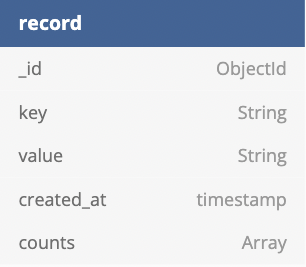

<h1 align="center">
    Getir Case Study
</h1>

<p align="center">
  
</p>

# Description

A RESTful API with a single endpoint that fetches the data in the provided MongoDB collection and return the results in the requested format

# Installation

```Bash
git clone https://github.com/burakkisacik/getir-nodejs-bootcamp-graduation-assignment-burakkisacik-Private.git
```

```Bash
 cd into the folder
 npm install
 npm run dev
```

# Example DB Schema

<p align="center">
  
</p>

# Endpoints

| Method | Routes          |            Request Payload             |        Return |
| ------ | --------------- | :------------------------------------: | ------------: |
| Post   | /api/v1/records | startDate, endDate, maxCount, minCount | filtered data |

# How it works

## Example Request

```JavaScript
const myHeaders = new Headers();
myHeaders.append("Content-Type", "application/json");

const raw = JSON.stringify({
  "startDate": "2015-01-01",
  "endDate": "2016-01-01",
  "minCount": 0,
  "maxCount": 100
});

var requestOptions = {
  method: 'POST',
  headers: myHeaders,
  body: raw,
  redirect: 'follow'
};

fetch("http://localhost:3000/api/v1/recordss", requestOptions)
  .then(response => response.text())
  .then(result => console.log(result))
  .catch(error => console.log('error', error));
```

## Example Response

```JSON
{
    "startDate" : "2015-01-01",
    "endDate" : "2016-01-01",
    "minCount" : 0,
    "maxCount" : 100
}
```
